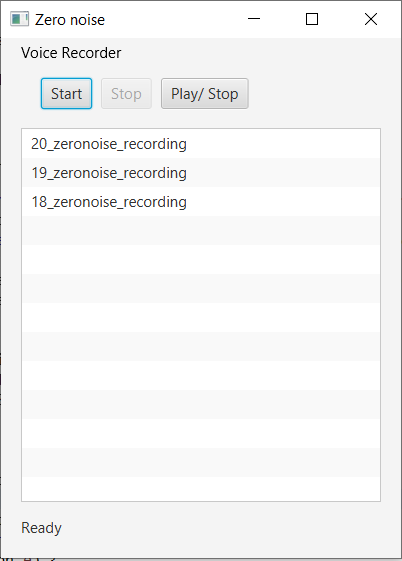

# Zeronoise
Zeronoise is a voice recorder tool

# Instructions for novice developers and users:
- Switch to releases tab or navigate to https://github.com/shnmkhk/zeronoise/releases
- Download the latest version <code>zeronoise-recorder-*.jar</code>
- Double click it

# Instructions for ambitious developers:

- Make sure Maven 3+ is installed and PATH is set
- Switch to the application directory from your favourite shell/ cmd
- Run <code>mvn clean install</code>
- You should find <code>zeronoise-recorder-*.jar</code> in target directory
- Either double click it or run using <code>java -jar target/zeronoise-recorder-*.jar</code>; and you should see the application opened as shown below

